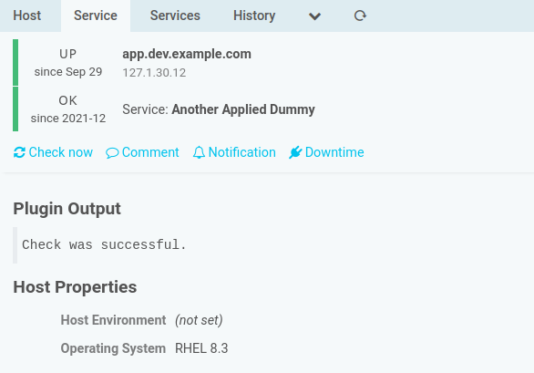
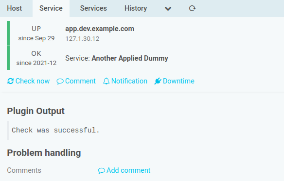

Implemented Hooks
=================

Show specific Host properties on all Services
------------------------------------

This module implements the `DetailviewExtension` hook provided by the `monitoring`
module. This allows to configure a set of Host Custom Variables, that should be
shown on every Service detail view.

You can configure such properties in `$ICINGAWEB_CONFIGDIR/modules/monitoringaddons/config.ini`,
with `$ICINGAWEB_CONFIGDIR` usually being `/etc/icingaweb2`:

```ini
[hostvars_on_services]
environment = "Host Environment"
os = "Operating System"
```

Eligible are all Host Variables, missing variables are shown as such:



In case this config section is missing or empty, the whole section isn't shown
at all:


